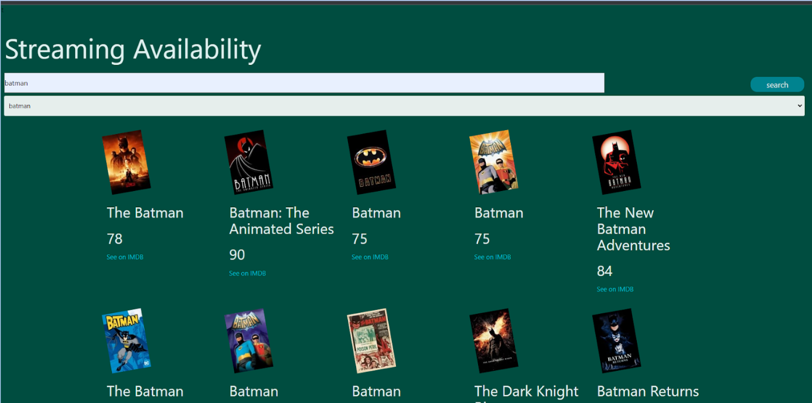

# Streaming Availability

## Description

Searchable database for looking up movies, shows, and music!

Our audience is people who watch movies on streaming platforms. This project addresses and provides a solution for the problem of not knowing where certan movies are being streamed.

We were motivated by our own personal interest in watching movies and experiencing the want to know where certan pieces of media were on the web.

Working on this, we gathered plenty of experence working as a group on a coding project. We learned more about the process developing a web application wth others, how to communicate thoroughly wth group mmembers, and how to implement/execute our individual concepts into a cohesive product that we all agree with.
<!-- Who is our audience, what were we motivated by.... why did we build this project.... what issue did it address and how is it solving it?.... what did we learn? -->

## Table of Contents

- [Installation](#installation)
- [Usage](#usage)
- [Credits](#credits)
- [License](#license)

## Installation

N/A

## Usage

This application can be used to search up the streaming availability of a show across several different streaming services. Once film names are entered using the searchbar, results for the film will be displayed on the page with their poster, respective IMDB rating, and potential links to where it may be streamed online. There is also a dropdown box where previous searches are indexed for accessibility; these previous searches can be clicked on in order to place them into the searchbar again.

The deployed application should look something like this:

Click [here](https://tmollerhoj.github.io/Streaming-Availability/) for the deployed application.

## Credits

* Used this [RapidAPI Streaming Availability API](https://rapidapi.com/movie-of-the-night-movie-of-the-night-default/api/streaming-availability/details) to implement our system of displaying what shows are on what services.
* Implemented [RapidAPI IMDb Top 100 Movies](https://rapidapi.com/rapihub-rapihub-default/api/imdb-top-100-movies) API to display the top 100 movies on our web application.
* Referenced [Professional README Guide](https://coding-boot-camp.github.io/full-stack/github/professional-readme-guide) for this README file.
* This project was a collaboration between Robert Hall, Thomas Mollerhoj, Luis Pardo, Heather Starr, and Niko Vu.

## License

MIT License
